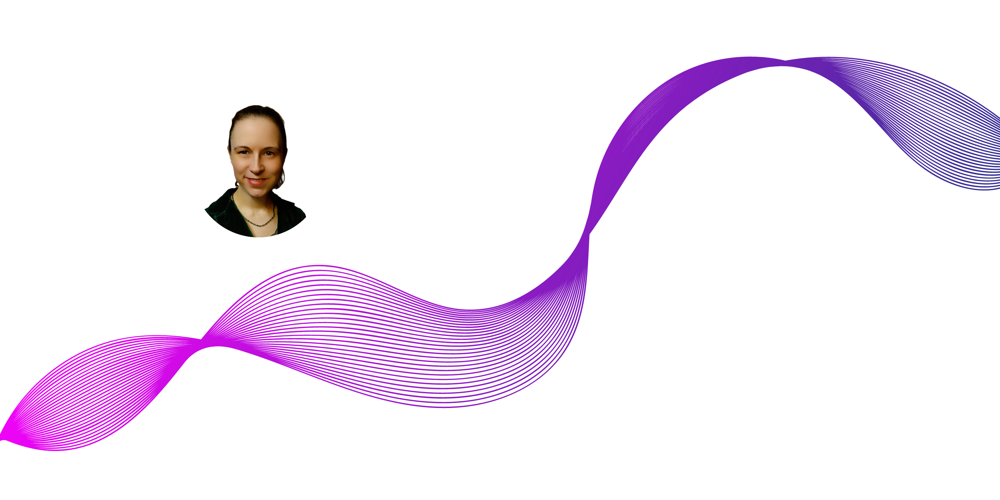

# Developer Portfolio Template 🚀

      

## What is this?

This simple portfolio is built on a templated designed by Yuji Sato jr. Thank you Yuji!!! 
I have modified the portfolio files to best showcase my skills in 2025. Thank you for taking a look.

View the [Demo](https://yujisatojr.github.io/react-portfolio-template/).

**This template is free to use, and no attribution is required.** 
 - If you want your own copy, please visit Yuji Sato Jr's repository and be sure to give him a star!

## Features

✅ Built with modern technologies (React, TypeScript, JavaScript, and SCSS) 
✅ Open source (free to use, no attribution required)  
✅ Responsive design & mobile-friendly  
✅ Supports both dark and light modes  
✅ Highly customizable multi-component layout